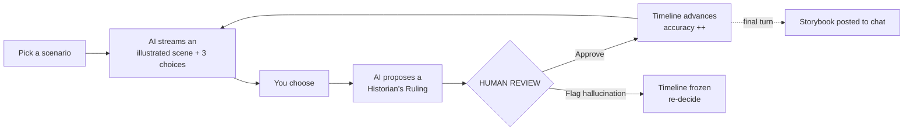
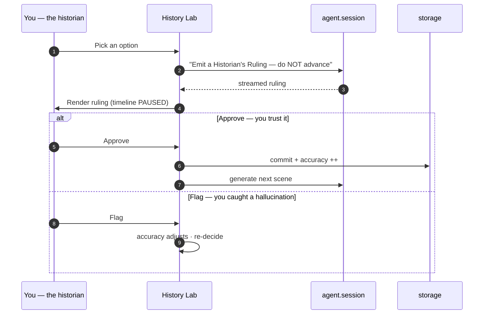
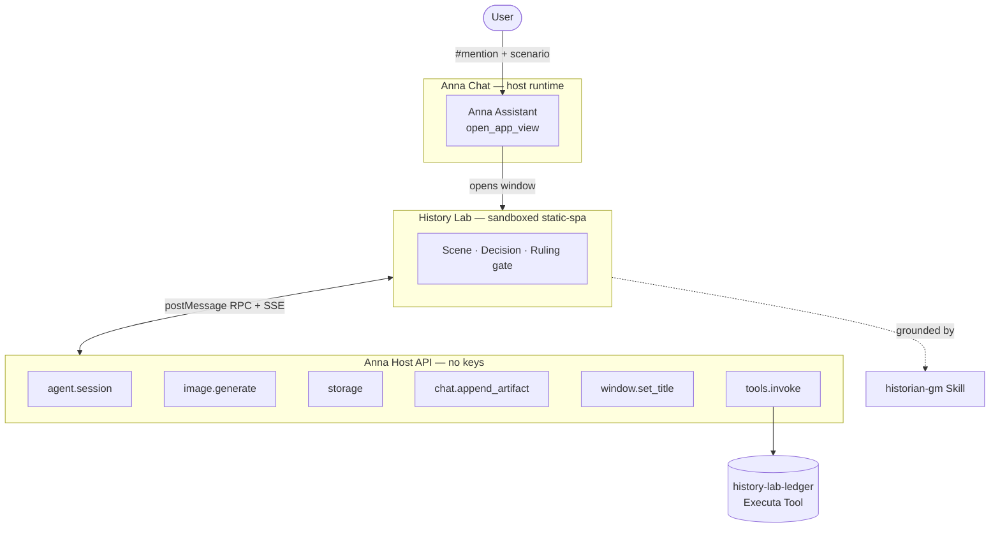

<div align="center">

# 🏛️ History Lab

### Replay a pivotal moment in history — and fact-check the AI to win.

[](https://youtu.be/iwHemJRhVRs)
[](https://anna.partners)
[](https://anna.partners/developers)

**[🎥 Watch the 2-min demo](https://youtu.be/iwHemJRhVRs)**  ·  **[📦 Code](https://github.com/EzraNahumury/-History-Lab)**  ·  **Runs live on Anna**

*AI generates · the human ratifies · Anna remembers*

</div>

---

## What it is

**History Lab** is an [Anna](https://anna.partners) App (schema-2) where you step into a real historical decision — the **Cuban Missile Crisis (1962)**, the **Catiline conspiracy (63 BC)**, or the **Apollo 11 landing (1969)**. Anna's agent streams a grounded scene with three real choices and generates period art.

The twist: **before the timeline can advance, the AI proposes a *"Historian's Ruling"* — and you must Approve it or Flag it as a hallucination.** Only your verdict moves the story forward, and your fact-checking accuracy updates live.

It teaches two skills in one loop: **historical reasoning**, and the meta-skill that matters most in an AI-saturated world — **catching a confident AI when it's wrong.**



---

## Why it's AI-native — not "a web app + an API"

History Lab can't exist as a standalone site calling an LLM endpoint. Every load-bearing capability is an Anna runtime primitive:

- **No API keys.** Scenes and rulings stream from `agent.session`; period art from `image.generate` — billed to the user's own Anna quota.
- **State is host-owned.** The timeline and accuracy live in `anna.storage`, durable across reloads and devices — no backend.
- **The assistant drives the UI.** A chat message opens the app window (`open_app_view`) straight onto a scenario.
- **Human-in-the-loop is the spine.** The agent only *proposes*; only your **Approve** mutates state.
- **The result returns to the conversation.** The final illustrated storybook is posted back into chat via `chat.append_artifact`.

---

## The core mechanic — the Human-Review Gate

The differentiator a plain chatbot can't replicate: the agent **proposes**, the human **disposes**, and only then does state change.



> 🛡️ The UI is the **only** code path that writes to `storage` — the agent has no write capability, so the human gate is *structurally* unbypassable. The accuracy score is recomputed by a deterministic **Executa tool**, outside the LLM, so it can never be hallucinated.

---

## Architecture



The bundle is a **`static-spa`** served immutably inside a sandboxed iframe under a locked CSP (`default-src 'none'`, `script-src 'self'`) — everything is bundled, no CDNs. Communication is `postMessage` → host bridge → RPC, with live tokens over SSE.

---

## Anna primitives used

| Capability | Host API | Grant |
|---|---|---|
| Streamed scene + rulings | `agent.session({submode:'auto'}).run()` | `agent` |
| Period art | `image.generate()` | `image` |
| Durable timeline + accuracy | `storage.get / set` (etag concurrency) | `storage` |
| Deterministic commit (un-hallucinable score) | `tools.invoke()` → `history-lab-ledger` | `tools` |
| Storybook into the chat | `chat.append_artifact()` | `chat` |
| Live title bar | `window.set_title()` | `window` |
| Assistant opens the window | `open_app_view(payload)` | LLM tool |

> **Executa = Tools + Skills.** History Lab ships both: a Python **Tool** (`history-lab-ledger` — deterministic scoring over stdio JSON-RPC, with a one-command [binary build](history-lab/executas/history-lab-ledger/package_binary.sh)) and a declarative **Skill** (`historian-gm` — grounding + ruling-format protocol).

---

## Run it locally

Verified on `anna-app@0.1.30` (needs **Node 22+** and [`uv`](https://docs.astral.sh/uv/)):

```bash
cd history-lab
npm install                      # local @anna-ai/cli — no global install
npx anna-app validate --strict   # ✓ schema + Host-API ACL coverage
npx anna-app dev --no-llm        # ✓ dashboard at http://127.0.0.1:5180/
node tests/logic.test.mjs        # ✓ 7/7 game-logic tests
```

The app ships **Mock mode ON by default**, so the entire loop runs **offline — deterministic, zero quota, no login**. Drop `--no-llm` (and toggle Mock off) to exercise Live mode.

📄 [`history-lab/RUN.md`](history-lab/RUN.md) — run & test  ·  📦 [`history-lab/PUBLISH.md`](history-lab/PUBLISH.md) — publish lifecycle (login → push → cut → install)

---

## Project structure

```
history-lab/
├── manifest.json              # schema-2: ui.host_api allowlist, csp, required_executas, dev block
├── app.json                   # store listing + bundled_executas
├── bundle/                    # static-spa SPA — no build step, no CDNs
│   ├── index.html  app.js     # entry + turn state machine / human-review gate
│   ├── agent.js  image.js     # agent.session stream + image.generate (graceful degradation)
│   ├── store.js  ledger.js    # storage (etag) + anna.tools.invoke → ledger Executa
│   ├── logic.js               # pure scoring — unit-tested, no SDK/DOM
│   ├── scenarios.js  ui.js    # 3 grounded scenarios + CSP-safe DOM rendering
│   └── anna-tool-ids.js       # handle → minted tool_id (auto-generated by anna-app)
├── executas/history-lab-ledger/   # TOOL — deterministic scoring (Python stdio JSON-RPC)
│   └── executa.json · ledger.py · pyproject.toml · package_binary.sh · uv.lock
├── skills/historian-gm/           # SKILL — grounding + ruling-format protocol
│   └── executa.json · SKILL.md
├── scenarios/                 # canonical scenario JSON (seed / docs)
├── tests/logic.test.mjs       # game-logic test suite (7/7)
├── scripts/set_tool_id.py     # rewrite placeholder → minted tool_id, in lockstep
└── RUN.md · PUBLISH.md
.github/workflows/             # CI — build executa binaries → GitHub Release
```

---

## How it maps to the judging criteria

| Criterion | Why History Lab scores |
|---|---|
| **Usefulness & user value** | Teaches a historical episode *and* the meta-skill of catching AI hallucinations — two real skills in one loop. |
| **Working demo** | One tight loop, bulletproof offline via Mock mode; verified end-to-end live on Anna. |
| **Meaningful use of AI** | Two host generation primitives **plus** a human-review gate that controls state — not a cosmetic chatbot. |
| **Fit with Anna** | `open_app_view`, `agent.session`, `image`, `storage`, `chat.append_artifact`, a bundled Executa **Tool + Skill**, least-privilege ACL. |
| **Creativity & execution** | Turning fact-checking into the *core mechanic* is a memorable, original hook; generated period art makes it instantly screenshot-friendly. |

---

## Submission

| | |
|---|---|
| 🎥 **Demo video** | https://youtu.be/iwHemJRhVRs |
| 📦 **Code** | https://github.com/EzraNahumury/-History-Lab |
| ⚙️ **Live on Anna** | v0.1.0 (app_id 111) — install from the Developer dashboard, then `#history-lab` in chat |

**History Lab** turns a pivotal historical moment into a branching, illustrated decision game — and makes **fact-checking the AI the core mechanic.** You mention the app and pick a scenario (e.g. the Cuban Missile Crisis, 1962). Anna's host agent streams a grounded scene while generating period-accurate art — no API or image key, billed to your own quota. The agent offers three real options; when you choose, it proposes a *"Historian's Ruling"* you must **Approve** or **Flag** as a hallucination. Only approved rulings commit to `storage` and advance the canonical timeline, while your accuracy updates live in the window title — and a final illustrated storybook is delivered back into the chat via `chat.append_artifact`.

It is for students and curious learners who want to *feel* a decision in context and sharpen their AI-literacy — and it is deeply Anna-native, with a real **human-review gate** at its center.

---

<div align="center">

**Built for the Anna AI-Native App Hackathon**

*AI generates · the human ratifies · Anna remembers*

</div>
