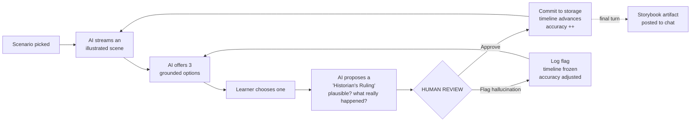
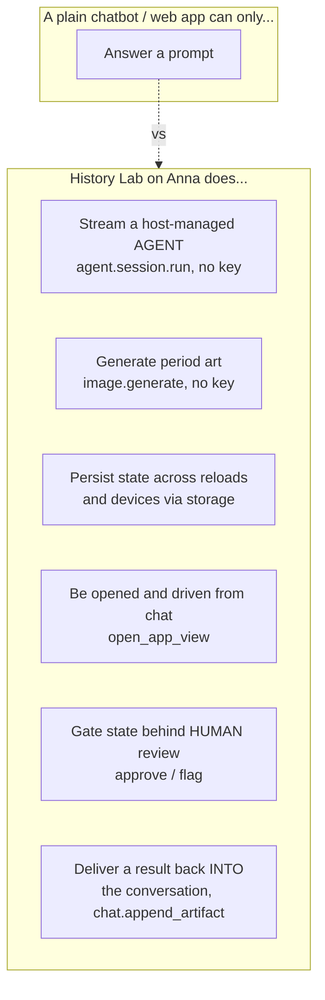
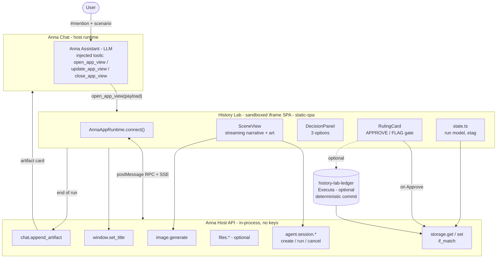
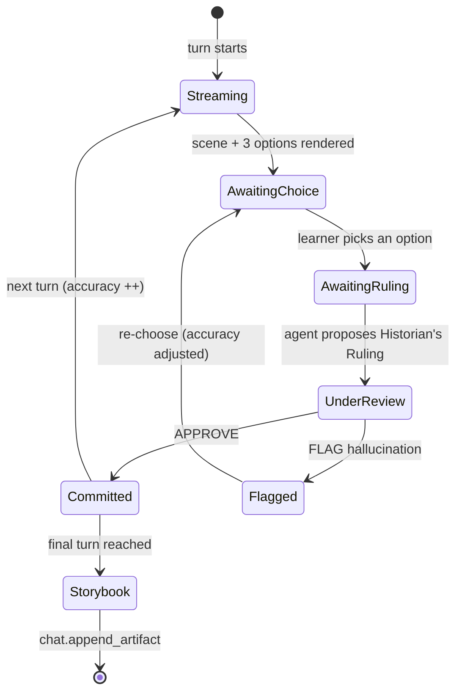
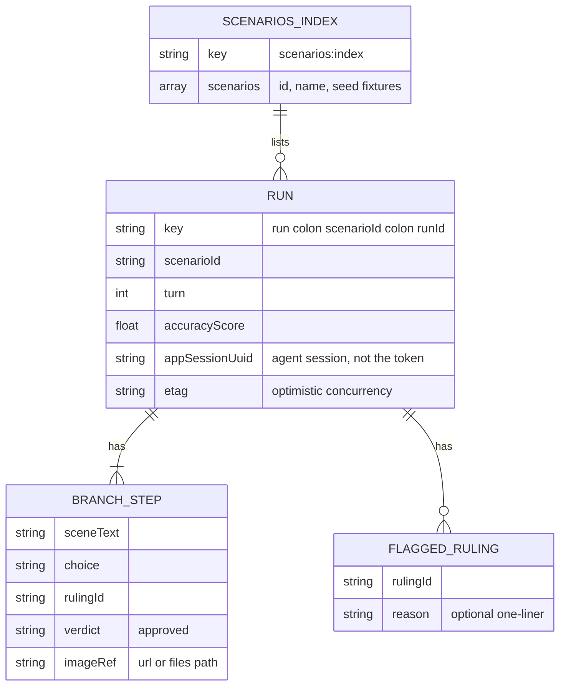
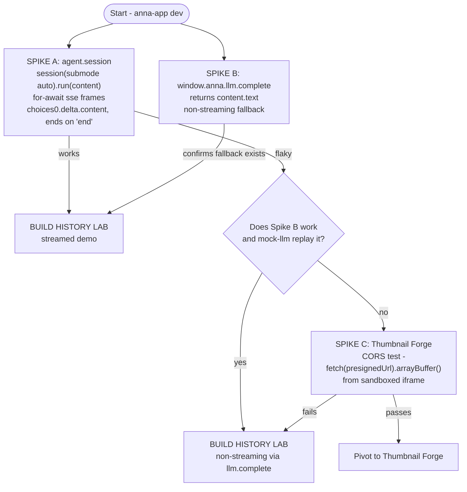
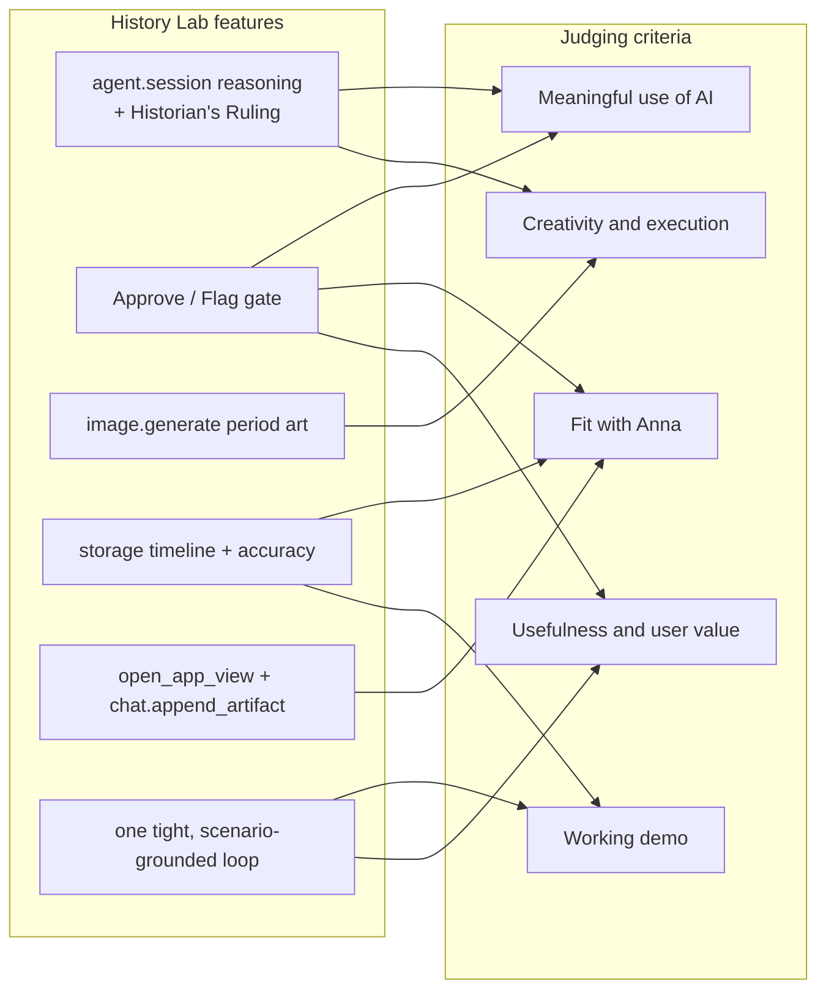

# 🏛️ History Lab

> **Replay a pivotal moment in history as a branching, illustrated decision game — where fact-checking the AI is the game.**

An **Anna App** (schema-2) built for the **Anna AI-Native App Hackathon**. You step into a real historical decision (the Cuban Missile Crisis, a Roman Senate vote, the Apollo 11 go/no-go), the AI streams an illustrated scene and three grounded choices — and before the timeline can advance, **you** must ratify or reject its *"Historian's Ruling."* Catching the model when it's wrong isn't a side feature; it's the win condition.

> **One line:** *AI generates, the human ratifies, Anna remembers.*

---

## 📑 Table of Contents

1. [Why this exists](#-why-this-exists)
2. [What History Lab is](#-what-history-lab-is)
3. [Why it's AI-native (not "web app + OpenAI")](#-why-its-ai-native-not-web-app--openai)
4. [The wow moments](#-the-wow-moments)
5. [Architecture](#-architecture)
6. [The core mechanic: the Human-Review Gate](#-the-core-mechanic-the-human-review-gate)
7. [Turn lifecycle](#-turn-lifecycle)
8. [State model](#-state-model)
9. [Anna primitives & host API usage](#-anna-primitives--host-api-usage)
10. [Tech stack](#-tech-stack)
11. [Project structure](#-project-structure)
12. [Build plan / MVP scope](#-build-plan--mvp-scope)
13. [Day-1 Go / No-Go spikes](#-day-1-go--no-go-spikes)
14. [Local development](#-local-development)
15. [Risks & mitigations](#-risks--mitigations)
16. [Scope-cut order](#-scope-cut-order-if-time-runs-short)
17. [How it maps to the judging criteria](#-how-it-maps-to-the-judging-criteria)
18. [Demo script](#-demo-script-150-seconds)
19. [Submission description](#-submission-description)
20. [Roadmap](#-roadmap)

---

## 🎯 Why this exists

History class is the memorization of dates; students rarely feel the *weight* of a real decision in its actual context. Meanwhile, naïve AI story-generators hallucinate freely and let players do anything — there's no learning guardrail, and no reason a "fact-check" should matter.

History Lab fuses two skills into one loop:

- **Historical reasoning** — weighing constraints, anticipating consequences, judging plausibility — by making the learner *live* the decision instead of reading about it.
- **AI literacy** — the more urgent meta-skill in an AI-saturated world: catching the machine when it's confidently wrong. Here, that *is* the gameplay.

> **Target users:** middle/high-school students and curious adults; secondarily teachers who want a 10-minute interactive in-class activity.

---

## 🧩 What History Lab is

A single, tight, **schema-2 Anna App**. The user `#`-mentions the app and picks a scenario. Then each **turn** runs this loop:



The **timeline cannot advance without a human verdict.** That single constraint turns Anna's "agent proposes / human decides" model into a literal, playable game mechanic.

---

## ⚡ Why it's AI-native (not "web app + OpenAI")

History Lab cannot exist as a standalone web app calling an API. Every load-bearing capability is an Anna runtime primitive:



- **No API keys, ever.** Generation runs on `agent.session.run` (streamed narrative + rulings) and `image.generate` (period art), both billed to the user's own Anna quota.
- **State is host-owned.** Timeline, branch path, and accuracy score live in `anna.storage` with `if_match` optimistic concurrency — durable and synced across devices, no backend.
- **The assistant drives the UI.** A `#`-mention can `open_app_view` the window and pass the scenario as `payload`.
- **Human-in-the-loop is the spine.** The agent's ruling is *proposed*; only the human's Approve mutates state.
- **It avoids every stubbed API** — it uses `agent.session.run` (not the host-api-stubbed `llm.complete` as a primary), `storage`/`files` (never local JSON), and `chat.append_artifact` (the implemented chat method, not the stubbed `write_message`/`read_history`).

---

## 🎬 The wow moments

| # | Moment | Anna primitive |
|---|---|---|
| 1 | Type *"replay the Cuban Missile Crisis"* in chat → **the app window opens by itself** and starts streaming. | `open_app_view` |
| 2 | A period-accurate 1962 war-room illustration **generates live, with zero image key.** | `image.generate` |
| 3 | The **Historian's Ruling** card: you choose *"naval blockade"*, the agent rules *"Plausible — this is what JFK chose,"* you Approve, the timeline advances. | `agent.session.run` + human gate |
| 4 | Next turn the ruling is **subtly wrong** — you **Flag it as a hallucination**, accuracy drops live in the title bar. | `window.set_title` + `storage` |
| 5 | **Reload the page mid-game** → the whole illustrated branch rehydrates with no backend. | `storage` |
| 6 | At the end, your **illustrated decision-storybook** lands right in the chat thread. | `chat.append_artifact` |

---

## 🏗️ Architecture



**Key architectural facts (verified against the live docs):**

- The bundle is a **`static-spa`** served immutably; the iframe is **sandboxed *without* `allow-same-origin`** (null/opaque origin) under a locked CSP (`default-src 'none'`, `script-src 'self'`). **Bundle everything — no CDNs.**
- Communication is `postMessage` → Host Bridge → RPC, with live events over **SSE**.
- To **display** generated art, add the image origin to `ui.csp_overrides.img-src` and use a plain `` tag (no `fetch`, so no CORS trap).

---

## 🔑 The core mechanic: the Human-Review Gate

This is the differentiator a chatbot cannot replicate. The agent **proposes**; the human **disposes**; only then does state mutate.

```mermaid
sequenceDiagram
    autonumber
    participant U as Learner
    participant APP as History Lab (iframe)
    participant AG as agent.session
    participant ST as storage

    U->>APP: Pick option (e.g. "Naval blockade")
    APP->>AG: run("Emit a Historian's Ruling - do NOT advance")
    AG-->>APP: stream ruling (plausible? what really happened?)
    APP->>U: Render RulingCard (timeline PAUSED)

    alt Human APPROVES
        U->>APP: Click "Approve"
        APP->>ST: storage.set(run, if_match=etag)  -- commit
        ST-->>APP: {etag, generation}
        APP->>APP: window.set_title("Turn N - Accuracy X%")
        APP->>AG: run("Generate next scene")
    else Human FLAGS hallucination
        U->>APP: Click "Flag as hallucination"
        APP->>ST: storage.set(flaggedRulings += ...) -- timeline NOT advanced
        APP->>APP: accuracy adjusted; same turn
    end
```

> 🛡️ **The UI is the only code path that mutates `storage`.** The agent has no write capability, so the human gate is *structurally* unbypassable.

---

## 🔄 Turn lifecycle

The state machine for one turn — and why the timeline can only move on an approved ruling:



---

## 💾 State model

All durable state lives in **`anna.storage`** (host-owned, `if_match`/etag concurrency, cross-device sync). Only **text + references** are stored — never image bytes — to stay far under the **256 KB/window** cap. Illustrations are referenced by URL/path; the demo can display them directly.



**Storage rules that matter:**

- `storage.get` returns `etag` as **optional** → guard `if_match` construction on the first write (use `exists:false`).
- A stale `if_match` returns the **`precondition_failed`** code (not a thrown error) → refetch & retry.
- Persist **`appSessionUuid`**, *not* the JWT (token TTL is 120s; the SDK auto-refreshes). Call `session.refresh()` after a reload.

---

## 🧰 Anna primitives & host API usage

Each row is a verified signature plus the exact ACL entry it requires in `manifest.ui.host_api`.

| Capability | Host API call (iframe SDK) | `ui.host_api` entry | Notes |
|---|---|---|---|
| Streamed narrative + rulings | `window.anna.agent.session({submode:'auto'}).run({content})` → async-iterable | `agent` | Tokens on `frame.event==='sse'` at `frame.choices[0].delta.content`; ends on `'end'`; handle `'error'`. **No final-result accessor — concatenate yourself.** |
| Non-streaming fallback | `window.anna.llm.complete({messages, maxTokens})` → `{content.text}` | `llm` | Backup if streaming/parse misbehaves. Verify in harness (stub-flagged on one host-api page). |
| Period art | `anna.image.generate({prompt, n?, size?})` → `{images:[{url}]}` | `image` | URL is **transient ~30 min**. MVP: **display via ``** (add origin to `csp_overrides.img-src`), don't fetch bytes. `image.edit` is **OFF by default** — descope. |
| Durable state | `anna.storage.get/set({key, value, if_match?})` | `storage` | 256 KB/window; etag concurrency. |
| Result into chat | `anna.chat.append_artifact({artifact:{kind?, summary?, payload_ref?, data?}})` → `{artifact_id}` | `chat` | Renders an artifact **card** (summary + ref). Inline image rendering is **not** guaranteed — plan a text-card fallback. |
| Live title | `anna.window.set_title("Turn N - Accuracy X%")` | `window` (always granted) | The "app responds to you" beat. |
| Assistant opens window | `open_app_view(app_id, view?, payload)` | n/a (LLM tool) | Param is named `payload`; surfaces as `entry_payload`. |
| Deterministic commit *(integrated)* | `anna.tools.invoke({tool_id, method:'commit_ruling', args})` | `tools` | Wired as a `required_executas` (`history-lab-ledger`); recomputes accuracy outside the LLM. Degrades to the identical `logic.js` formula. |

> ⚠️ **ACL is unforgiving:** every method you call must be allow-listed in `ui.host_api.<namespace>`, or the call returns `permission_denied` at runtime even though the SDK exposes it. Run `anna-app validate --strict` to confirm coverage. `manifest.permissions[]` is **audit/display only** — it is *not* the enforced gate.

### Core flow in pseudocode

```ts
const anna = await AnnaAppRuntime.connect();
await anna.window.hello(); await anna.window.ready();
let run = (await anna.storage.get(`run:${sid}:${rid}`))?.value ?? newRun(sid);

// start / resume the agent session (persist the UUID, never the token)
if (!run.appSessionUuid) {
  const s = await window.anna.agent.session({ submode: "auto",
    systemPrompt: scenarioSystemPrompt(scenario) });   // grounded facts + ruling contract
  run.appSessionUuid = s.app_session_uuid;
} else {
  await s.refresh();
}

// stream the scene + 3 options; parse ONLY at the terminal frame
let buf = "";
const stream = s.run({ content: `Turn ${run.turn}: open the scene, give exactly 3 grounded options.
Return JSON between <<<BEGIN>>> and <<<END>>> with keys scene, options[3].` });
for await (const frame of stream) {
  if (frame.event === "error") { handleError(frame); break; }
  if (frame.event === "sse")  buf += frame.choices?.[0]?.delta?.content ?? "";
  if (frame.event === "end")  break;
}
const { scene, options } = parseEnvelope(buf);   // regex-extract + JSON.parse, fallback to raw text

// generate + DISPLAY period art (no fetch -> no CORS trap)
const img = await anna.image.generate({ prompt: scenePrompt(scene) });
render(scene, options, img.images[0].url);

// learner chooses -> agent PROPOSES a ruling (does NOT advance)
const choice = await ui.pickOption(options);
const ruling = await runForRuling(s, choice);    // same stream/parse pattern

// THE HUMAN GATE — the only place storage is mutated
const verdict = await ui.reviewCard(ruling);     // "approve" | "flag"
if (verdict === "approve") {
  run.branchPath.push({ scene, choice, rulingId: ruling.id, verdict: "approved", imageRef: img.images[0].url });
  run.turn += 1; run.accuracyScore = bump(run);
} else {
  run.flaggedRulings.push({ rulingId: ruling.id, reason: ui.flagReason });
  run.accuracyScore = recompute(run);
}
const put = await anna.storage.set(`run:${sid}:${rid}`, run, { if_match: run.etag });  // precondition_failed -> retry
run.etag = put.etag;
await anna.window.set_title(`Turn ${run.turn} - Accuracy ${run.accuracyScore}%`);

// end of run -> storybook card into chat
if (isFinal(run)) {
  await anna.chat.append_artifact({ artifact: { kind: "history-lab-storybook",
    summary: `${scenario.name} - Accuracy ${run.accuracyScore}%`,
    data: { branchPath: run.branchPath, flagged: run.flaggedRulings } } });
}
```

---

## 🛠️ Tech stack

| Layer | Choice |
|---|---|
| App type | Anna App, **manifest `schema: 2`** (Pydantic `extra='forbid'` — no stray fields) |
| UI | **React 18 + TypeScript**, built with **Vite** into a `static-spa` bundle; plain CSS; **all assets bundled** (locked CSP) |
| Host bridge | `AnnaAppRuntime.connect()` from `/static/anna-apps/_sdk/latest/index.js`; `AnnaAppWM` for windowing |
| AI | `agent.session.*` (primary) + `image.generate`; `llm.complete` (fallback) |
| State | `anna.storage` (+ `anna.files` only if persisting art durably — *optional*) |
| Executa (wired) | `history-lab-ledger` — Python (uv), JSON-RPC 2.0 over stdio, loops on stdin until EOF, logs to stderr; `required_executas` + `ui.host_api.tools`, called via `anna.tools.invoke` |
| Skill | `historian-gm/SKILL.md` — steers the agent to stay grounded + emit a structured ruling |
| Tooling | `@anna-ai/cli` (`anna-app init/dev/validate/doctor`), Node 22+, `uv` (Astral) |

---

## 📁 Project structure

```
history-lab/
├── manifest.json                 # schema-2: ui.bundle, ui.views, ui.host_api,
│                                 # csp_overrides, system_prompt_addendum, dev{ }
├── app.json                      # store listing metadata
├── bundle/                       # built static-spa SPA (immutable, self-contained)
│   ├── index.html                # iframe entry; loads the Anna App SDK
│   ├── app.js                    # Vite output
│   ├── styles.css
│   └── assets/                   # bundled fonts/icons (NO CDNs)
├── src/                          # SPA source (built into bundle/)
│   ├── main.tsx                  # connect(); window.hello/ready handshake
│   ├── state.ts                  # storage read/write, etag, run model
│   ├── agentClient.ts            # agent.session.create/run/cancel + SSE parse
│   ├── imageClient.ts            # image.generate -> display (optional files persist)
│   ├── chatArtifact.ts           # assemble + chat.append_artifact storybook
│   └── views/
│       ├── SceneView.tsx         # streaming narrative + illustration
│       ├── DecisionPanel.tsx     # 3 grounded options
│       └── RulingCard.tsx        # the human-review APPROVE / FLAG gate
├── scenarios/                    # grounded scenario seeds (facts + system prompts)
│   ├── cuban-missile-1962.json   # the MVP scenario
│   ├── roman-senate.json
│   └── apollo11-go-nogo.json
├── executas/                     # bundled Tool Executa (required_executas)
│   └── history-lab-ledger/       # deterministic commit Tool (Python stdio)
│       ├── executa.json          # publish + dev metadata + binary distribution profiles
│       ├── pyproject.toml        # [project].name == [scripts] key == minted tool_id
│       ├── package_binary.sh     # build a releasable PyInstaller binary (forum /t/140)
│       └── ledger.py             # initialize / describe / health / invoke / shutdown
├── skills/                       # declarative grounding Skill (standalone, publishable)
│   └── historian-gm/
│       ├── executa.json          # skill publish metadata (anna-app executa publish)
│       └── SKILL.md              # steers grounding + ruling format
├── fixtures/                     # JSONL recordings for --mock-llm + replay
│   └── cuban-missile.jsonl
├── tests/
│   └── bundle.test.ts            # mountBundle vitest (ACL gating + call recording)
└── README.md
```

---

## 📦 Build plan / MVP scope

> Calibrated for a **~2-day** window. The **Must** list must be finishable in ~1.5 days; the rest is polish.

### ✅ Must Have (ship-or-die)
- Schema-2 manifest with `ui.views` (Scene + Decision/Review panel), **least-privilege `ui.host_api`** (`window, agent, image, storage, chat`), `csp_overrides.img-src`, and a `system_prompt_addendum`.
- `agent.session.create + run` streaming an opening scene + 3 grounded options for **one hard-coded scenario** (Cuban Missile Crisis).
- The **Historian's Ruling card** with working **Approve / Flag** buttons that gate timeline advance.
- `storage.set/get` persistence of `branchPath` + `accuracyScore`, **rehydrated on reload**.
- `image.generate` one illustration per scene, **displayed via ``**.
- `window.set_title` live `"Turn N - Accuracy X%"`.
- `chat.append_artifact` storybook card at the end.
- `dev` block: `seed_storage` + `--mock-llm <fixture>` so the demo runs **offline and deterministically**.

### 🟡 Should Have
- `open_app_view` so the assistant opens the window from a chat request (the marquee opening beat). ✅
- A 2nd & 3rd scenario via a dropdown. ✅ (Cuban Missile Crisis, Catiline 63 BC, Apollo 11)
- Deterministic commit via the `history-lab-ledger` Executa (`tools.invoke`). ✅ (wired as `required_executas`; binary-distributable via `package_binary.sh` + CI)
- Optional one-line reason on Flag; `agent.session.cancel` Stop button; graceful UI for `permission_denied` / `quota_exceeded` / `state_too_large`.

### 🟢 Nice to Have
- `historian-gm` Skill that nudges the agent toward plausible-but-tricky rulings (so flagging is meaningful).
- "Classroom mode" aggregate accuracy (`storage.list`); branch-path tree visualization; difficulty toggle; storybook HTML export; durable art persistence to `files`.

---

## 🚦 Day-1 Go / No-Go spikes

Before writing feature code, retire the biggest unknowns in the dev harness (by **end of hour 3**):



- **GO History Lab** if Spike A works **OR** (A is flaky **but** B works and you accept a non-streaming demo).
- **Pivot to Thumbnail Forge** only if **both A and B** fail to return usable assistant text — then proceed only if the Thumbnail Forge CORS spike passes.

> **Why this rule:** an adversarial audit found both apps have near-equal raw demo probability (~45% vs ~42% in 2 days), but **History Lab's risks all have documented fallbacks**, while Thumbnail Forge's headline "approve-to-durable-files" depends on a contestant-uncontrollable R2-CORS gate with **no workaround**. History Lab is the higher-ceiling *and* demo-safer bet once you weight fallback existence over first-try probability.

---

## 💻 Local development

**Prerequisites:** Node 22+, `uv` (Astral).

```bash
# 1. Install the Anna CLI
npm i -g @anna-ai/cli

# 2. Scaffold (slug is immutable once created)
anna-app init history-lab --slug history-lab
cd history-lab

# 3. Build the SPA into bundle/ (confirm ZERO external CDN references - CSP is locked)
npm run build

# 4. (Optional) smoke-test the ledger Executa
anna-app executa dev   # under executas/history-lab-ledger

# 5. Run the harness OFFLINE & deterministic (dashboard at http://127.0.0.1:5180/)
anna-app dev --mock-llm fixtures/cuban-missile.jsonl

# 6. Verify ACL coverage + environment
anna-app validate --strict
anna-app doctor
```

The manifest **`dev` block** powers the deterministic demo:

```jsonc
{
  "dev": {
    "fixtures": ["fixtures/*.jsonl"],
    "seed_storage": { "scenarios:index": { /* curated scenarios */ } },
    "user_id": 1,
    "mocks": { /* keyed by "ns.method", e.g. "tools.invoke": {...} */ }
  }
}
```

> ⚠️ **`--mock-llm` requires a fixture-path argument** (it is *not* a bare flag), and it is **unverified whether it can replay streamed `agent.session` frames** — test this on Day 1. By default `anna.llm.*` / `anna.agent.*` bridge to a real Nexus and need auth, so a guaranteed offline demo depends on this working.
>
> 🔒 **Demo from the dev dashboard with private visibility.** Do **not** depend on last-minute public-Hub publishing — it requires a paid plan, Verified Developer status, and immutable review with no SLA.

---

## ⚠️ Risks & mitigations

| Risk | Likelihood | Mitigation |
|---|---|---|
| `agent.session` SSE parsing is the demo's spine — a bad frame loop shows a frozen panel | High | Handle `queued/started/sse/end/error` explicitly; null-guard `delta?.content`; **unit-test the parser**; force a strict JSON/delimited envelope from the agent. |
| Free-form prose won't parse into "3 options" / a "ruling" | High | Instruct a fenced-JSON envelope (`<<<BEGIN>>>...<<<END>>>`); parse with regex-extract + `JSON.parse`, **fallback to raw-text render** (degrade, don't crash). |
| `llm.complete` is stub-flagged on one doc page | Medium | Primary path is `agent.session.run`; treat `llm.complete` as a *fallback* and verify in harness. |
| Image URL expires (~30 min) | Medium | MVP only **displays** art via ``; if persisting, copy bytes to `files` promptly on generate (not on approve). |
| `chat.append_artifact` may not render the storybook inline | Medium | Treat it as a **card** (summary + `payload_ref`); the in-app storybook view is the real visual. |
| `--mock-llm` may not replay streamed agent frames | Medium | Test Day-1; if it can't, drop streaming to `llm.complete` single-shot (which is clearly mockable) for the deterministic demo. |
| Agent commits/advances the timeline itself | Medium | Enforce "emit ruling, do NOT advance" in **both** systemPrompt and the `historian-gm` Skill; **UI is the only writer** to `storage`. |
| ACL gap → `permission_denied` | Medium | List exactly the methods called in `ui.host_api`; run `anna-app validate --strict`; keep the manifest free of unknown fields (`extra='forbid'`). |
| 256 KB/window storage cap | Low | Store only text + refs (never image bytes / full transcripts). |
| Live quota → `APP_QUOTA_EXCEEDED` (429) on stage | Low | Run the stage demo with `--mock-llm` + `seed_storage` (zero quota); keep a recorded backup video. |
| JWT TTL 120s / agent idle 30 min | Low | Never cache the token (SDK auto-refreshes); persist `appSessionUuid`; `session.refresh()` after reload; `cancel` before `delete`. |

---

## ✂️ Scope-cut order (if time runs short)

Cut in this order — **protect the human-in-the-loop gate last**, because it's the whole point:

1. **Cut durable `files` persistence of art** → display via `` only (removes the entire CSP-`connect-src` + CORS risk surface; biggest hour savings for least demo value).
2. **Drop live streaming** → `window.anna.llm.complete` single-shot per turn (lose token animation, keep the full reasoning + 3 options + ruling).
3. **Collapse two parse stages into one** LLM call returning `scene + options + ruling` in a single strict envelope.
4. **Hardcode one scripted Cuban Missile Crisis turn** (`seed_storage` + a recorded path) for a deterministic on-stage run.
5. **Last resort:** make `chat.append_artifact` a plain-text storybook card.

> **Never cut:** the **Approve / Flag-as-hallucination** gate, the `storage`-backed accuracy score, and the `window.set_title "Turn N - Accuracy X%"` — that trio *is* the memorable differentiator.

---

## 🏆 How it maps to the judging criteria



| Criterion | Why History Lab scores |
|---|---|
| **Usefulness & user value** | Teaches a historical episode *and* the meta-skill of catching AI hallucinations — two real skills in one loop. |
| **Working demo** | One tight loop, made bulletproof by the `dev` block (`mocks`, `seed_storage`, `--mock-llm`), with graceful fallbacks at every risky step. |
| **Meaningful use of AI** | Two host generation primitives (text agent + image) *plus* a human-review gate that controls state — not a cosmetic chatbot. |
| **Fit with Anna** | Exercises `open_app_view`, `agent.session`, `image`, `storage`, `chat.append_artifact`, least-privilege ACL, `#`-mention activation — and pointedly avoids every stubbed API. |
| **Creativity & execution** | Turning fact-checking into the *core mechanic* is a memorable, original hook; generated period art makes it instantly screenshot-friendly. |

---

## 🗣️ Demo script (~150 seconds)

> *"History is usually memorizing dates, and AI will happily make facts up. So in History Lab, **checking the AI is the game.** Watch — in Anna chat I just type 'replay the Cuban Missile Crisis,' and the app window opens itself. An illustrated 1962 war-room scene streams in, with period art generated live — no API key, billed to my own quota. The agent gives me three real options. I choose a naval blockade. Now the twist: before the story can move, the agent proposes a **Historian's Ruling** — 'Plausible: this is what JFK actually chose.' I'm the reviewing historian, so I approve, and only now does the timeline advance. Next turn the ruling looks subtly wrong, so I **flag it as a hallucination** — accuracy drops live in the title bar. At the end, my whole illustrated decision-storybook lands right in the chat. I reload — it remembers everything. That's Anna: AI generates, the human ratifies, state and story live in the conversation."*

---

## 📝 Submission description

**History Lab** is an Anna App that turns a pivotal historical moment into a branching, illustrated decision game — and makes **fact-checking the AI the core mechanic.** You `#`-mention the app and pick a scenario (e.g. the Cuban Missile Crisis, 1962). Anna's host agent (`agent.session.run`) streams a grounded opening scene while the host generates period-accurate art (`image.generate`) — **no API or image key, billed to your own quota.** The agent offers three real options. When you choose, it proposes a *"Historian's Ruling"* — was this plausible, and what really happened? Acting as the reviewing historian, you **Approve** the ruling or **Flag** it as a hallucination; only approved rulings commit to `storage` and advance the canonical timeline, while your accuracy score updates live in the window title.

It is for students and curious learners who want to *feel* a decision in context and sharpen their AI-literacy. It is deeply Anna-native: two host generation primitives, durable cross-device state (`storage`) and art (`files`), an assistant that opens and drives the window (`open_app_view`), and a final illustrated storybook delivered back into the chat via `chat.append_artifact` — with a real **human-review gate** at its center.

---

## 🗺️ Roadmap

- [ ] **Day 1 AM** — Spike A (agent stream) + Spike B (llm.complete fallback); lock the Go/No-Go.
- [ ] **Day 1** — Scaffold schema-2 app; one Cuban Missile Crisis turn end-to-end (scene → options → ruling → approve/flag → storage → set_title).
- [ ] **Day 1 PM** — `dev` block (`seed_storage` + `--mock-llm` fixture) for a deterministic offline demo.
- [ ] **Day 2 AM** — `image.generate` art display; `chat.append_artifact` storybook; reload rehydration; error-path hardening.
- [ ] **Day 2** — Polish, record a backup demo video, write the submission.
- [ ] **Should-have (if time):** `open_app_view` opening beat, 2nd/3rd scenario, `history-lab-ledger` deterministic commit.

---

<div align="center">

**Built for the Anna AI-Native App Hackathon** · *AI generates, the human ratifies, Anna remembers.*

</div>
